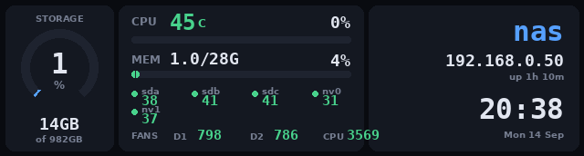

# Front LCD Control (eDP-1)

> How ZettOS drives the 3.49" front panel, and how to reproduce it on Ubuntu. Includes backlight control, rendering options, and an explanation of the HDMI resolution conflict documented elsewhere in this repo.

> **Verified working on Ubuntu 26.04 / kernel 7.0.0-30-generic on a D6 Ultra (2026-09-14).** The stock-firmware observations were read from a running ZettOS install on the same machine; the Ubuntu procedures below were then run end to end and are in daily use.

## Panel Facts

| Property | Value |
|---|---|
| Connector | `card0-eDP-1` |
| Native resolution | **172×640 portrait** — not 640×172 |
| Colour depth | 32 bpp |
| fbdev stride | 704 bytes/row (176 px padded) |
| fbdev name | `i915drmfb` (`/dev/fb0`) |
| Backlight | `/sys/class/backlight/intel_backlight` |
| Backlight range | 0 – **192000** |

The panel is physically mounted rotated. Content must be rotated 90° to read normally.

## How ZettOS Does It

```
weston.service            Wayland compositor, drm-backend.so, on tty7
  └─ zettos-lcd-display   LVGL application, renders via lv_wayland
```

Relevant details from `/lib/systemd/system/zettos-lcd-display.service`:

```ini
After=weston.service
Wants=weston.service

Environment="WAYLAND_DISPLAY=wayland-1"
Environment="XDG_RUNTIME_DIR=/run"
Environment="LD_LIBRARY_PATH=/zettos/emmc/lib"
ExecStart=/zettos/emmc/bin/zettos-lcd-display
```

The binary is an [LVGL](https://lvgl.io/) app (`_lv_wayland_flush`, `lv_font_d_din_pro_*`) that reads its brightness setting from `/zettos/emmc/config/lcd_brightness` and writes to:

```
/sys/devices/pci0000:00/0000:00:02.0/drm/card0/card0-eDP-1/intel_backlight/brightness
```

which is the same file as `/sys/class/backlight/intel_backlight/brightness`.

ZettOS' `weston.ini` uses `backend=drm-backend.so` with no `[output]` section — Weston drives each connector at its own native mode.

## Why HDMI Gets Forced to the LCD Resolution

[kernel-parameters.md](kernel-parameters.md) and [ubuntu-installation.md](ubuntu-installation.md) record this as unresolved: enabling `eDP-1` forces HDMI to 640×172. Here is the mechanism.

i915 exposes **one** fbdev emulation device (`/dev/fb0`) for the whole card, shared by every enabled connector. `fbcon` must pick a single mode that fits them all, so a connected 172×640 panel drags the console down to something that fits both.

**This limitation belongs to fbdev/fbcon, not to the hardware.** Any KMS-aware client — Weston, X, or a direct DRM program — sets modes per connector independently and is unaffected.

ZettOS proves it. Its kernel command line contains **no `video=` parameter at all**:

```
i915.enable_guc=3 i915.max_vfs=7 i915.force_probe=* i915.request_timeout_ms=60000
quiet systemd.show_status=false vt.global_cursor_default=0 console=tty2
snd_intel_dspcfg.dsp_driver=1 nvme_core.default_ps_max_latency_us=0 ...
```

`eDP-1` is enabled and HDMI works, because Weston owns the display and the console was moved out of the way with `console=tty2`.

### What this means for Ubuntu

`video=eDP-1:d` **disables the connector at kernel level**. Nothing can then use the LCD — not Weston, not a DRM client, nothing.

| Goal | Kernel command line |
|---|---|
| HDMI console readable, LCD unused | keep `video=eDP-1:d` (current repo default) |
| Use the LCD | **remove** `video=eDP-1:d` |

If you remove it, the tty on HDMI may look wrong. On a headless NAS that is cosmetic — you reach it over SSH. Borrow ZettOS' mitigation if it bothers you:

```bash
GRUB_CMDLINE_LINUX_DEFAULT="quiet console=tty2 vt.global_cursor_default=0 modprobe.blacklist=r8169 snd_intel_dspcfg.dsp_driver=1"
```

> Keep `video=eDP-1:d` during installation regardless. The installer runs on the console, which is exactly the thing this conflict breaks. Remove it afterwards.

## Backlight Control

This works with no extra software and is the whole answer to "turn the display on and off".

```bash
cat /sys/class/backlight/intel_backlight/max_brightness    # 192000
cat /sys/class/backlight/intel_backlight/brightness

# Off
echo 0      | sudo tee /sys/class/backlight/intel_backlight/brightness

# 50%
echo 96000  | sudo tee /sys/class/backlight/intel_backlight/brightness

# Full
echo 192000 | sudo tee /sys/class/backlight/intel_backlight/brightness
```

> On a freshly booted ZettOS the value is `0` — the panel is dark by default on a headless unit. If you see nothing on the LCD, check this before assuming your rendering is broken.

### Without sudo

```bash
sudo tee /etc/udev/rules.d/90-backlight.rules > /dev/null << 'EOF'
ACTION=="add", SUBSYSTEM=="backlight", KERNEL=="intel_backlight", RUN+="/bin/chgrp video /sys/class/backlight/%k/brightness", RUN+="/bin/chmod g+w /sys/class/backlight/%k/brightness"
EOF

sudo usermod -aG video $USER
sudo udevadm control --reload-rules && sudo udevadm trigger
# log out and back in
```

## Rendering Options

### Option 1: Direct framebuffer (what this repo uses)

No compositor needed. Write pixels straight to `/dev/fb0`. Three working scripts ship
with this repo:

| Script | Purpose |
|---|---|
| [`lcd-stats`](lcd-stats) | Renders live system stats to the panel; runs as a systemd service |
| [`lcd-power`](lcd-power) | Backlight on / off / toggle / percentage |
| [`lcd-grab`](lcd-grab) | Reads the framebuffer back into a PNG — useful for iterating on layout without standing in front of the machine |
| [`rgb-raw.py`](rgb-raw.py) | Sends LED frames with an explicit speed byte, including a `--sweep` mode for mapping the protocol |

```bash
sudo install -m 755 lcd-stats lcd-power lcd-grab /usr/local/sbin/
sudo apt install -y python3-pil fonts-dejavu-core
sudo lcd-power on
sudo lcd-stats --once
```

#### Two things that cost time the first go

**`mmap` + `flush()` fails on this framebuffer** with `OSError: [Errno 22] Invalid
argument`. `msync` on the i915 fbdev device rejects it. Plain `seek` + `write` works:

```python
row = 172 * 4                       # 688 visible bytes
with open("/dev/fb0", "r+b", buffering=0) as fh:
    for y in range(640):
        fh.seek(y * 704)            # stride is 704, not 688
        fh.write(raw[y * row:(y + 1) * row])
```

The 16-byte difference between stride (704) and visible row (688) is padding — skip it
rather than writing into it.

**Pillow has no `RGBX` image mode.** `img.convert("RGBX")` raises. The raw *encoder*
mode is what you want, applied straight to an RGB image:

```python
raw = img.tobytes("raw", "BGRX")    # i915 XRGB8888 little-endian
```

#### Rotation

Render a landscape 640×172 canvas, then rotate to the panel's 172×640:

```python
img = img.transpose(Image.ROTATE_270)   # ROTATE_90 comes out upside down
```

On this chassis `ROTATE_270` is upright. If yours is inverted, flip that one constant.

> `/dev/fb0` is shared with `fbcon`. If a console is active on the same device it will
> overwrite your output on the next redraw. Move the console away with `console=tty2`,
> or use Option 2. On a headless box the idle console does not repaint, so in practice
> this is not a problem.

### Option 2: Weston + a Wayland client (what ZettOS does)

```bash
sudo apt install -y weston
sudo nano /etc/xdg/weston/weston.ini
```

```ini
[core]
backend=drm-backend.so
require-input=false
idle-time=0

[shell]
panel-position=none
startup-animation=none
locking=false
background-color=0xff000000

[output]
name=eDP-1
mode=172x640
transform=90
```

`transform=90` is the piece ZettOS handles inside its LVGL app — setting it in Weston means your client can draw in normal landscape orientation and Weston rotates it.

Run Weston on a spare VT, then launch any Wayland client against it:

```bash
WAYLAND_DISPLAY=wayland-1 XDG_RUNTIME_DIR=/run your-client
```

### Option 3: cage + a browser (most flexible)

For a dashboard — disk usage, temperatures, container status — render it as HTML and point a kiosk browser at it:

```bash
sudo apt install -y cage
cage -- chromium --kiosk --app=http://localhost:8080/lcd
```

This is the easiest route to "show whatever I want", since you design the panel in HTML/CSS and can rotate with a CSS transform.

### Option 4: LVGL

If you want the ZettOS look specifically, `zettos-lcd-display` is an LVGL app using the `lv_wayland` driver. LVGL is open source; the fonts it uses are D-DIN Pro. This is the most work and the least reason to bother unless you are targeting a very constrained redraw budget.

## Live Stats Panel

`lcd-stats` draws a single-screen dashboard sized for the 640×172 landscape canvas:

```
        CPU  45C                    0% |
 ( 1% )  [####----------------------]  |        nas
 14GB   MEM  1.0/28G                4% |  192.168.0.50
/982GB   [##------------------------]  |    up 1h 5m
         sda 39 sdb 41 sdc 42 nv0 30   |
STORAGE  nv1 38                        |   20:33:00
         FANS  797    786    3558      |
```



A capacity arc on the left, live CPU and memory meters in the middle, every drive
temperature below them, and identity on the right. Storage is summed across all mounted
real filesystems (`ext4`, `xfs`, `btrfs`, `zfs`, …), deduplicated by filesystem id, so
a pool shows up automatically once you create one.

Values come from sysfs, `/proc`, and `smartctl`; temperatures shift green → amber → red
as they rise, and the capacity arc turns amber past 75 % and red past 90 %. Refresh
interval is `INTERVAL` at the top of the script.

The drive row is **adaptive**: every SATA device found by `smartctl` plus every NVMe
with a `hwmon` temperature is listed, six per row, wrapping to a second row — so a
fully populated 8-bay chassis with two NVMe drives still fits. SATA drives use a
47/55 °C warn/hot threshold, NVMe 60/70 °C, since they run hotter by design.

`smartctl` is slow enough to stall a 5-second redraw, so it is polled once every
`SMART_EVERY` ticks and cached in between. sysfs values still update every frame.

> **Turn off the console cursor** or a white block blinks on top of your output:
>
> ```bash
> echo 0 | sudo tee /sys/class/graphics/fbcon/cursor_blink
> ```
>
> The shipped systemd unit does this in `ExecStartPre`. Without it the cursor sits
> wherever the console last left it and repaints on its own schedule.

Capture what the panel currently shows, without leaving your desk:

```bash
sudo lcd-grab /tmp/lcd.png
```

That reads the framebuffer back and writes a PNG, already rotated to landscape. It
makes layout work a normal edit-and-look loop instead of walking to the machine.

## Suggested systemd Service

```ini
[Unit]
Description=Front LCD display
After=multi-user.target

[Service]
Type=simple
ExecStartPre=/bin/sh -c 'echo 120000 > /sys/class/backlight/intel_backlight/brightness'
ExecStart=/usr/local/sbin/lcd-display.py
ExecStopPost=/bin/sh -c 'echo 0 > /sys/class/backlight/intel_backlight/brightness'
Restart=always
RestartSec=5

[Install]
WantedBy=multi-user.target
```

`ExecStopPost` blanks the panel when the service stops, so a crash leaves a dark screen rather than a frozen frame.

## RGB LEDs — Already Solved

The LED protocol is fully documented in [rgb-led-control.md](rgb-led-control.md). Verified against ZettOS on 2026-09-14:

- Device present: `Bus 003 Device 002: ID 5759:4358 ZettLab ZettOS_RGB`
- `cdc_acm` is loaded
- The mode names inside ZettOS' own binaries — `BREATHE_MODE`, `FLOW_MODE`, `FOUNTAIN_MODE`, `GRADIENT_MODE`, `FLICKER_MODE`, `LIGHT_MODE` — match the documented modes 0–6 exactly

Nothing further to reverse-engineer. Use `rgb_control.py` from this repo.

> ZettOS itself does not expose `/dev/ttyACM0`; its own services talk to the device without the tty layer. Under Ubuntu the `cdc_acm` driver claims it normally and the serial node appears, which is what `rgb_control.py` expects.

## Related Guides

- [rgb-led-control.md](rgb-led-control.md) — LED protocol and control script
- [kernel-parameters.md](kernel-parameters.md) — where `video=eDP-1:d` is set
- [ubuntu-installation.md](ubuntu-installation.md) — keep the parameter during install
